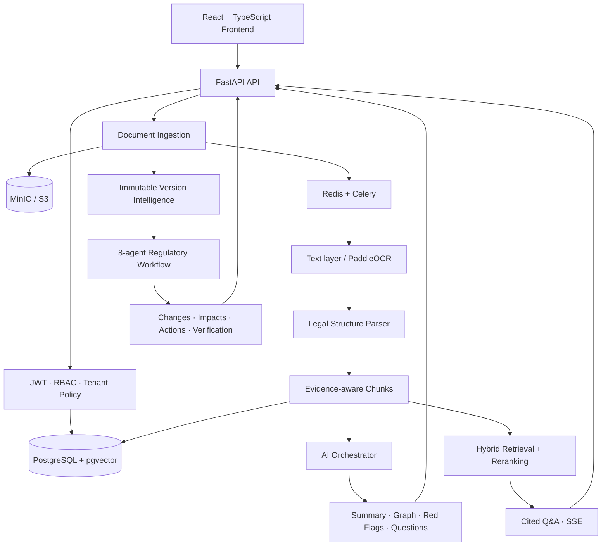
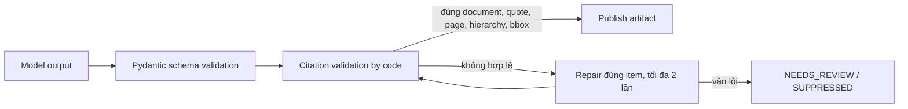

<div align='center'>

# VADS

### Vietnamese Administrative Document System

**Biến văn bản hành chính thành quyết định có căn cứ, có người chịu trách nhiệm và có thể kiểm chứng.**

*Evidence-first AI for Vietnamese administrative and regulatory documents.*


[Mã nguồn tích hợp](https://github.com/nguyenlebinhan/VADS) ·
[Backend](https://github.com/nguyenlebinhan/VADS/tree/SU) ·
[Frontend](https://github.com/nguyenlebinhan/VADS/tree/SU/frontend) ·
[Figma Prototype](https://www.figma.com/design/b7Egr7gD623CWdrn6JdVpK/VADS---Prototype) ·
[API Catalog](https://github.com/nguyenlebinhan/VADS/blob/main/docs/api-catalog.md)

</div>

## Đề bài VADS giải quyết

Trong công việc hành chính, một văn bản mới hiếm khi chỉ cần được “đọc và tóm tắt”. Cán bộ còn
phải đối chiếu nhiều phiên bản, xác định điều khoản nào thay đổi, thay đổi đó tác động đến đề án
nào, đơn vị nào phải xử lý và căn cứ nằm chính xác ở đâu trong tài liệu gốc.

Các cách làm thủ công hoặc chatbot PDF thông thường để lại bốn khoảng trống lớn:

- khó đọc đồng nhất PDF có text, bản scan và tài liệu lai;
- khó theo dõi thay đổi ngữ nghĩa khi số Điều/Khoản hoặc cách diễn đạt bị đổi;
- câu trả lời AI có thể hợp lý nhưng thiếu bằng chứng đủ để ra quyết định;
- kết quả phân tích không gắn với dự án, phòng ban, hành động và lịch sử kiểm duyệt.

> **VADS trả lời bốn câu hỏi nghiệp vụ:** Văn bản mới thay đổi gì? Tác động đến công việc nào?
> Ai cần hành động? Bằng chứng nằm ở đâu?

## Giải pháp trong một phút

VADS là nền tảng full-stack xử lý tài liệu hành chính tiếng Việt theo hướng **evidence-first**:

1. **Tiếp nhận an toàn** PDF/DOCX, kiểm tra MIME, magic bytes, kích thước và SHA-256.
2. **Số hóa có chọn lọc** bằng text layer hoặc PaddleOCR, giữ tọa độ trang và vùng nguồn.
3. **Hiểu cấu trúc pháp lý** theo Chương → Điều → Khoản → Điểm thay vì cắt văn bản tùy ý.
4. **Phân tích đa tác vụ** để tạo tóm tắt, knowledge graph, red flag và câu hỏi phản biện.
5. **Theo dõi phiên bản** và phát hiện thay đổi về giá trị, thời hạn, trách nhiệm, căn cứ.
6. **Ánh xạ tác động** đến dự án, phòng ban và hành động đề xuất bằng nhiều tín hiệu giải thích được.
7. **Chặn hallucination trước khi công bố** bằng citation validator và publication gate viết bằng code.
8. **Bảo vệ dữ liệu đa đơn vị** bằng tenant scope, RBAC, refresh rotation và audit append-only.

### Những con số có thể kiểm chứng trong repository

| Bằng chứng | Giá trị | Ý nghĩa |
|---|---:|---|
| Agent trong luồng Regulatory Change | **8** | Tách intake, versioning, semantic diff, legal research, graph, impact, advisor và verification |
| Test case tự động được đặc tả trên `main` | **110** | Bao phủ pipeline, AI, security, retrieval, chat và vertical slice |
| API operation khi bật đầy đủ compatibility mode | **68** | Từ ingestion đến impact review, Q&A và quản trị |
| API operation an toàn bật mặc định | **20** | Health check và 19 operation tenant-scoped `/api/v1` |
| Chế độ tài liệu PDF | **3** | `TEXT_BASED`, `SCANNED`, `HYBRID` để chỉ OCR khi cần |
| Thời hạn access token | **10 phút** | Giảm cửa sổ rủi ro; refresh token được rotate theo từng lần dùng |

Số operation được khóa bằng test catalog; 110 là số test function tự động hiện có trên nhánh
`main`, không phải con số coverage tự khai báo.

## Điều làm VADS khác biệt

| Năng lực | Cách VADS triển khai | Bằng chứng kỹ thuật |
|---|---|---|
| AI có căn cứ | Mỗi claim giữ document, chunk, quote, page, legal hierarchy và bounding box | [`CitationValidator`](app/citations/validator.py) |
| Publication gate | Citation sai được sửa tối đa hai lần; vẫn sai thì chuyển `NEEDS_REVIEW` hoặc suppress | [`SummaryService`](app/summaries/service.py), [`RedFlagService`](app/red_flags/service.py) |
| Semantic diff có kiểu | Phân biệt `VALUE_CHANGED`, `RESPONSIBILITY_CHANGED`, `UNCHANGED`; lưu old/new evidence | [`regulatory_change/diff.py`](https://github.com/nguyenlebinhan/VADS/blob/main/app/regulatory_change/diff.py) |
| Tác động giải thích được | Không dùng một similarity score duy nhất; kết hợp domain, budget, stage, department, legal basis và thời gian | [`regulatory_change/impact.py`](https://github.com/nguyenlebinhan/VADS/blob/main/app/regulatory_change/impact.py) |
| Không bịa dữ liệu thiếu | Không có phiên bản trước thì hệ thống trả `NEEDS_HUMAN_REVIEW`, không tự tạo thay đổi | [`test_regulatory_change_vertical_slice.py`](https://github.com/nguyenlebinhan/VADS/blob/main/app/tests/test_regulatory_change_vertical_slice.py) |
| Orchestration quan sát được | DAG có dependency, retry, fallback, schema validation và audit từng model execution | [`app/orchestrator`](app/orchestrator) |
| Bảo mật theo tài nguyên | Role chỉ là điều kiện cần; tenant, owner, grant và state policy vẫn được kiểm tra | [`authentication-authorization.md`](docs/authentication-authorization.md) |
| Thiết kế thay adapter được | Storage, OCR, model gateway, embedding, reranker và transcriber đều nằm sau interface | [`app/model_gateway`](app/model_gateway), [`app/storage`](app/storage) |

## Kịch bản demo end-to-end

Vertical slice trong repository mô phỏng đúng một quyết định nghiệp vụ, không chỉ một màn hình:

1. Tạo đề án **“Phát triển du lịch cộng đồng”** đang chờ thẩm định.
2. Upload phiên bản văn bản năm 2024:
   - ngưỡng phê duyệt: **500 triệu đồng**;
   - thời hạn báo cáo: **30 ngày**;
   - đơn vị phê duyệt: **UBND tỉnh**.
3. Upload phiên bản năm 2026:
   - ngưỡng phê duyệt: **800 triệu đồng**;
   - thời hạn vẫn là **30 ngày**;
   - đơn vị phê duyệt đổi thành **Sở Tài chính**.
4. VADS tự động trả về:
   - `VALUE_CHANGED`: 500 → 800 triệu đồng;
   - `UNCHANGED`: giữ thời hạn hiện hành 30 ngày;
   - `RESPONSIBILITY_CHANGED`: UBND tỉnh → Sở Tài chính;
   - vị trí nguồn cũ/mới: Khoản 2, Điều 10 → Khoản 3, Điều 12;
   - mức tác động `HIGH`, confidence `0.9`, kèm bằng chứng từ cả văn bản và đề án;
   - Phòng Kế hoạch và Phòng Tài chính cùng các hành động cần thực hiện.
5. Chuyên gia có thể `ACCEPTED`, `REJECTED` hoặc yêu cầu human review. Mỗi lần retry tạo một
   agent run mới; kết quả cũ không bị ghi đè.

Toàn bộ kịch bản trên được kiểm tra tại
[`test_two_versions_diff_project_impact_and_agent_audit`](https://github.com/nguyenlebinhan/VADS/blob/main/app/tests/test_regulatory_change_vertical_slice.py).

## Kiến trúc hệ thống

VADS dùng **modular monolith**: một codebase để phát triển nhanh trong MVP, nhưng ranh giới module
và provider đủ rõ để tách worker/service khi tải tăng.



### Luồng dữ liệu tài liệu

```text
Upload
  → validate extension + MIME + magic bytes + filename + size + SHA-256
  → lưu binary bất biến trên MinIO/S3
  → commit Document + DocumentFile + ProcessingJob
  → Celery worker
      → phân loại TEXT_BASED / SCANNED / HYBRID
      → trích text layer hoặc OCR đúng trang cần thiết
      → lưu page + block + table + bounding box
      → parse Chương / Điều / Khoản / Điểm
      → tạo chunk kèm legal metadata và source anchor
```

PostgreSQL là nguồn dữ liệu chuẩn; object storage chỉ giữ binary. Vì không có transaction ACID
chung giữa hai hệ thống, upload dùng **compensating transaction**: nếu commit database thất bại,
object vừa upload được xóa bù. Job `UPLOADED` là recovery point để Celery Beat phát lại idempotently.

### Publication gate cho kết quả AI



Đây là nguyên tắc cốt lõi của VADS: **model đề xuất; code kiểm chứng; con người quyết định ở ca
không chắc chắn**.

## Quy trình 8 agent

```text
DocumentIntakeAgent
  → VersionResolutionAgent
  → SemanticDiffAgent
  → LegalResearchAgent
  → KnowledgeGraphAgent
  → ImpactAnalysisAgent
  → DepartmentAdvisorAgent
  → VerificationAgent
```

Mỗi run, task, output, confidence, evidence và verification result đều được persist. Phiên bản cũ
không bị ghi đè; retry tạo attempt mới để phục vụ audit và tái lập kết quả.

Song song với luồng deterministic Regulatory Change, AI orchestrator tổng quát sử dụng
`ModelRegistry` để chọn model theo tác vụ, chạy DAG theo dependency, retry primary, fallback có
kiểm soát và validate structured output. `FptAiModelGateway` kết nối trực tiếp FPT AI Marketplace
qua HTTPS; business module không phụ thuộc SDK của nhà cung cấp.

## Ma trận tính năng

| Nhóm | Năng lực đã có | Trạng thái MVP |
|---|---|---|
| Document pipeline | PDF/DOCX, selective OCR, legal hierarchy, chunk/source anchor, reprocess | Đã triển khai; compatibility API cho demo local |
| AI analysis | Summary có citation, knowledge graph, red flag, critical questions | Đã triển khai; cần FPT AI key hoặc provider adapter |
| Regulatory intelligence | Immutable versions, typed diff, timeline, impact, department actions, verification | Đã triển khai trên `main`; compatibility API cho demo local |
| Retrieval & Q&A | pgvector store, hybrid retrieval, reranking, cited answer, SSE | Đã triển khai; embedding/reranker mặc định là adapter deterministic/lexical |
| Security | Login, refresh rotation, logout, RBAC, tenant policy, soft delete, audit | Secure `/api/v1` bật mặc định |
| Frontend | Login, hồ sơ, tài liệu, admin/user portal, document analysis UX | Secure core nối API thật; không chèn dữ liệu nghiệp vụ demo khi API rỗng hoặc lỗi |
| Deployment | Docker Compose local; API/worker/beat/frontend tách service trên Railway | Cấu hình và runbook đã có trên `main` |

## Bảo mật và Responsible AI

| Rủi ro | Kiểm soát trong VADS |
|---|---|
| IDOR qua UUID của xã khác | Tenant-scoped repository + policy; trả 404 cho tài nguyên ngoài scope |
| Access token cũ sau khi khóa tài khoản | JWT 10 phút + kiểm tra session và `token_version` trong database |
| Refresh token bị phát lại | Opaque 256-bit token, HMAC hash, rotation và revoke toàn token family khi reuse |
| Password spraying | Argon2id, đếm lần thất bại, lock window và response không làm lộ identifier |
| Mass assignment | Pydantic `extra=forbid`; commune, owner và role do server quyết định |
| Sửa/xóa audit | ORM guard và PostgreSQL trigger theo mô hình append-only |
| AI trích dẫn sai | Citation validator đối chiếu document, chunk, quote, page, hierarchy và bbox |
| AI tự suy diễn khi thiếu dữ liệu | Fail closed sang `NEEDS_HUMAN_REVIEW`; HIGH/CRITICAL thiếu nguồn bị suppress |
| Cấu hình production yếu | Startup từ chối secret mặc định, debug, wildcard CORS và legacy API |

Thiết kế threat model, permission matrix và 20 tình huống authorization nằm tại
[`docs/authentication-authorization.md`](docs/authentication-authorization.md).

## Công nghệ sử dụng

| Lớp | Công nghệ |
|---|---|
| Frontend | React, TypeScript, Vite, Tailwind CSS, MUI, Radix UI, Recharts |
| API & contracts | Python 3.12, FastAPI, Pydantic v2, OpenAPI |
| Persistence | PostgreSQL, SQLAlchemy 2, Alembic, pgvector |
| Background jobs | Celery, Redis, Celery Beat |
| File & OCR | MinIO/S3, PyMuPDF, python-docx, PaddleOCR tiếng Việt |
| AI | FPT AI Marketplace gateway, task-based model registry, structured output validation |
| Retrieval | Hybrid semantic/keyword search, metadata filter, reranking, SSE streaming |
| Security | Argon2id, JWT HS256, opaque refresh rotation, RBAC + ABAC-style resource policy |
| Delivery | Docker, Docker Compose, Railway, Caddy |
| Quality | Pytest, HTTPX, Ruff, Postman collections |

## Cấu trúc repository

```text
VADS/
├── app/
│   ├── api/v1/              # API bảo mật, tenant-scoped
│   ├── documents/           # upload, validation, lifecycle
│   ├── extraction/          # PDF/DOCX/OCR và bounding boxes
│   ├── structure/           # parser Chương/Điều/Khoản/Điểm
│   ├── chunking/            # chunk giữ legal metadata/source anchor
│   ├── orchestrator/        # model routing, DAG, retry/fallback, audit
│   ├── summaries/           # cited, versioned summaries
│   ├── knowledge_graph/     # entity/relation extraction + validation
│   ├── red_flags/           # rule engine + reasoning verification
│   ├── regulatory_change/   # 8-agent version/diff/impact vertical slice
│   ├── vector_store/        # pgvector index
│   ├── retrieval/           # hybrid retrieval
│   ├── chat/                # evidence-backed Q&A + SSE
│   ├── model_gateway/       # provider-neutral gateway + FPT adapter
│   └── tests/               # unit, integration, security, vertical slice
├── frontend/                # React/Vite admin & user portals
├── alembic/                 # versioned database migrations
├── docs/                    # architecture, API, security, deployment, Postman
├── scripts/                 # demo document generator
├── docker-compose.yml
└── pyproject.toml
```

## Chạy nhanh

### Yêu cầu

- Git và Docker Desktop/Docker Engine có Compose;
- Node.js + npm nếu chạy frontend ngoài Docker;
- FPT AI API key nếu muốn gọi model thật.

### 1. Clone và khởi động backend

```bash
git clone https://github.com/nguyenlebinhan/VADS.git
cd VADS
cp .env.example .env
docker compose up --build
```

Trên PowerShell, thay lệnh copy bằng:

```powershell
Copy-Item .env.example .env
```

Sau khi khởi động:

| Dịch vụ | URL |
|---|---|
| Swagger UI | `http://localhost:8000/api/docs` |
| ReDoc | `http://localhost:8000/api/redoc` |
| OpenAPI JSON | `http://localhost:8000/api/openapi.json` |
| Health check | `http://localhost:8000/health/live` |
| MinIO Console | `http://localhost:9001` |

### 2. Bật luồng demo đầy đủ ở local

Các product API chưa tenant-scope hoàn chỉnh được fail-closed theo mặc định. Chỉ để demo local,
đặt trong `.env`:

```dotenv
VADS_ENVIRONMENT=local
VADS_LEGACY_API_ENABLED=true
VADS_FPT_AI_ENABLED=true
VADS_FPT_AI_API_KEY=<your-fpt-ai-marketplace-key>
```

Không bật compatibility mode ở staging/production; validator của ứng dụng cũng chủ động từ chối
cấu hình này.

### 3. Chạy frontend

```bash
cd frontend
npm ci
npm run dev
```

Frontend mặc định mở tại `http://localhost:5173` và proxy `/api` đến backend cổng `8000`.

### 4. Chạy demo Regulatory Change

```bash
python scripts/generate_regulatory_demo_documents.py
```

Sau đó import:

- [VADS Postman collection](https://github.com/nguyenlebinhan/VADS/blob/main/docs/postman/VADS.postman_collection.json);
- [Regulatory Change collection](https://github.com/nguyenlebinhan/VADS/blob/main/docs/postman/Regulatory-Change-Vertical-Slice.postman_collection.json);
- [VADS Local environment](https://github.com/nguyenlebinhan/VADS/blob/main/docs/postman/VADS.postman_environment.json).

Collection tự lưu các ID quan trọng từ response để có thể chạy tuần tự toàn bộ flow.

## Bản đồ API

| Phạm vi | Nhóm endpoint tiêu biểu |
|---|---|
| Secure core | `/api/v1/auth`, `/api/v1/admin/users`, `/api/v1/documents`, `/api/v1/admin/audit-logs` |
| Document intelligence | `/api/workspaces/{id}/documents`, `/pages`, `/sections`, `/chunks`, `/reprocess` |
| AI artifacts | `/analysis`, `/summaries`, `/knowledge-graph`, `/red-flags`, `/critical-questions` |
| Regulatory change | `/documents/{id}/versions`, `/timeline`, `/changes`, `/analyze` |
| Impact & action | `/projects`, `/impacts`, `/impacts/{id}/review`, `/agent-runs/{id}` |
| Retrieval & chat | `/index`, `/retrieval/search`, `/chat/sessions` |

Danh mục đầy đủ, request shape và canonical route nằm tại
[`docs/api-catalog.md`](https://github.com/nguyenlebinhan/VADS/blob/main/docs/api-catalog.md).

### Upload và hỏi đáp RAG từ frontend

Portal người dùng chỉ sử dụng API bảo mật và dữ liệu thuộc tenant hiện tại:

```text
POST /api/v1/documents
GET  /api/v1/documents
POST /api/v1/documents/{id}/reprocess
DELETE /api/v1/documents/{id}
POST /api/v1/rag/query
```

File gốc được lưu ở object storage; database lưu metadata, trạng thái xử lý và các chunk dùng cho
retrieval. Đặt `VADS_USER_DOCUMENT_UPLOAD_ENABLED=true` để cho phép tài khoản USER tải tài liệu.
Endpoint RAG cần `OPENAI_API_KEY` hoặc `VADS_OPENAI_API_KEY`; có thể đổi endpoint/model tương thích
bằng `VADS_OPENAI_BASE_URL` và `VADS_OPENAI_CHAT_MODEL`. Khi API rỗng hoặc lỗi, frontend hiển thị
đúng trạng thái đó và không thay thế bằng dữ liệu mẫu.

## Kiểm thử và chất lượng

### Backend

```bash
python -m pip install -e '.[dev]'
pytest
ruff check app
ruff format --check app
docker compose config --quiet
```

### Frontend

```bash
cd frontend
npm ci
npm run build
```

Bộ test bao phủ các rủi ro khó, không chỉ happy path:

- file giả extension/MIME/magic bytes, file rỗng/quá cỡ và duplicate checksum;
- rollback bù khi storage/database lỗi, state regression, retry và worker failure;
- PDF text/scan/hybrid, OCR bounding box và legal hierarchy qua nhiều trang;
- model routing, private policy, retry/fallback và structured output lỗi;
- citation sai document, quote không tồn tại, red flag thiếu bằng chứng;
- semantic diff hai phiên bản, impact hai phía, idempotency, retry audit;
- login limit, token hết hạn, refresh replay, cross-tenant IDOR, mass assignment;
- hybrid retrieval, reranking fallback, chat history, citation và SSE.

Test local dùng SQLite và provider giả để chạy nhanh; tài liệu security ghi rõ PostgreSQL integration
test vẫn cần cho `FOR UPDATE`, partial index, composite FK và append-only trigger trước production.

## Triển khai

Docker Compose cung cấp API, worker, beat, PostgreSQL/pgvector, Redis và MinIO cho môi trường local.
Trên Railway, hệ thống tách thành các service độc lập:

```text
frontend ──private network──> api
                                ├── PostgreSQL/pgvector
                                ├── Redis <── worker + beat
                                └── S3-compatible Bucket
```

API chạy Alembic ở pre-deploy; worker và beat không có public domain; frontend được Caddy phục vụ
và proxy API qua private network. Runbook đầy đủ nằm tại
[`docs/deploy-railway.md`](https://github.com/nguyenlebinhan/VADS/blob/main/docs/deploy-railway.md).

## Ranh giới MVP và hướng phát triển

Nhóm chủ động ghi rõ ranh giới để kết quả demo không bị hiểu nhầm là tuyên bố production:

- secure `/api/v1` là bề mặt bật mặc định; các module product cần hoàn tất tenant scope trước khi
  được bật ở production;
- embedding và reranker mặc định hiện là adapter deterministic/lexical, sẵn điểm nối cho provider
  production;
- legal relation được gắn nhãn `EXTRACTED_NOT_EXTERNALLY_VERIFIED` cho đến khi có connector nguồn
  pháp luật chính thức;
- scanned PDF phải hoàn tất OCR trước khi semantic evidence extraction;
- agent Regulatory Change đang chạy đồng bộ trong vertical slice; contract đã persist để chuyển
  sang Celery mà không đổi API;
- frontend chỉ hiển thị dữ liệu từ secure API; các màn hình nâng cao chưa có endpoint tenant-scoped
  được chủ động ẩn thay vì dùng dữ liệu prototype.

Ưu tiên tiếp theo là hợp nhất toàn bộ product API vào policy tenant-scoped, kết nối embedding và
nguồn pháp luật production, chuyển agent dispatch sang Celery, sau đó chạy PostgreSQL security,
load và recovery test trên staging.

## Đối chiếu tiêu chí chấm dự án

| Tiêu chí | Bằng chứng trong VADS |
|---|---|
| Mức độ phù hợp bài toán | Đi từ văn bản mới đến thay đổi, dự án bị tác động, đơn vị phụ trách và hành động |
| Tính đổi mới | Kết hợp legal hierarchy, typed semantic diff, multi-agent verification và citation publication gate |
| Chiều sâu kỹ thuật | Pipeline nền, provider abstraction, persistent DAG/audit, pgvector, multi-tenant security |
| Khả năng ứng dụng | Có frontend, API catalog, Postman flow, Docker Compose và Railway runbook |
| Responsible AI | Evidence-first, fail closed, human review, private routing và không log raw prompt/document |
| Khả năng mở rộng | Modular monolith với ranh giới module rõ; API/worker/beat/frontend đã tách process |
| Khả năng kiểm chứng | Source link cụ thể, 110 test case, demo định lượng và audit không ghi đè lịch sử |

## Liên kết dự án

- **Repository chính:** <https://github.com/nguyenlebinhan/VADS>
- **Nhánh backend:** <https://github.com/nguyenlebinhan/VADS/tree/SU>
- **Frontend đã tích hợp trên SU:** <https://github.com/nguyenlebinhan/VADS/tree/SU/frontend>
- **Kiến trúc Regulatory Change:** [docs/regulatory-change-architecture.md](https://github.com/nguyenlebinhan/VADS/blob/main/docs/regulatory-change-architecture.md)
- **Thiết kế authentication/authorization:** [docs/authentication-authorization.md](docs/authentication-authorization.md)
- **AI orchestration:** [app/orchestrator/README.md](app/orchestrator/README.md)
- **Figma prototype:** <https://www.figma.com/design/b7Egr7gD623CWdrn6JdVpK/VADS---Prototype>
- **Contributors:** <https://github.com/nguyenlebinhan/VADS/graphs/contributors>

---

<div align='center'>

**VADS không chỉ giúp đọc văn bản nhanh hơn — VADS giúp biến thay đổi pháp lý thành hành động có thể kiểm chứng.**

</div>
