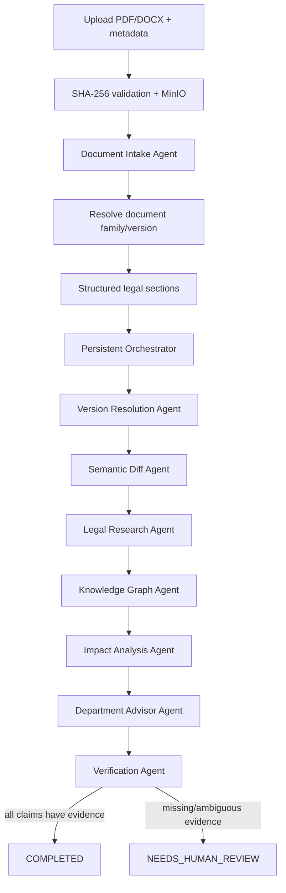
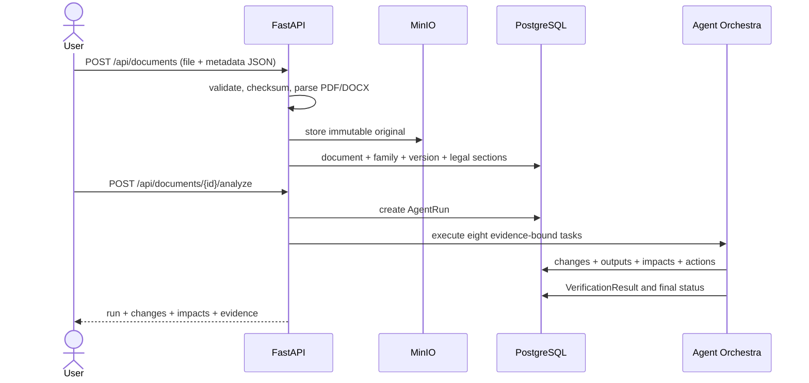
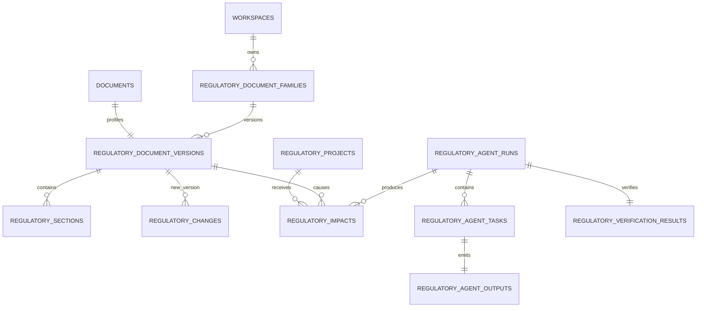

# Regulatory Change Intelligence — Python MVP

## Architecture decision

The MVP extends the existing FastAPI modular monolith instead of introducing another deployment.
It reuses PostgreSQL, MinIO/S3, the PDF/DOCX validation pipeline and the shared API envelope. New
business logic lives in `app/regulatory_change` and only depends on stable document identifiers.

Agent execution is synchronous for the first vertical slice, but state is never kept only in
memory. Every run, task, output and verification result is persisted. Moving execution to the
existing Celery/Redis worker later does not require changing the agent contracts or API response.

The semantic-diff MVP is deterministic and evidence-first. It compares typed facts extracted from
both versions. It deliberately returns `NEEDS_HUMAN_REVIEW` when there is no previous version and
does not ask an LLM to manufacture missing facts.

## Module boundaries

```text
app/regulatory_change/
├── intake.py        PDF/DOCX text extraction, legal hierarchy, family key
├── diff.py          typed, evidence-backed semantic facts and changes
├── impact.py        multi-signal project matching and department advice
├── orchestrator.py  persistent eight-agent execution and verification
├── models.py        immutable versions, changes, projects, impacts, audit
├── repository.py    SQLAlchemy read/write boundary
├── service.py       transactions, DTO mapping and use cases
├── schemas.py       Pydantic API contracts
└── router.py        FastAPI endpoints
```

Existing modules retain ownership of file validation, SHA-256 duplicate detection, original object
storage, workspace membership and background OCR/chunking.

`app/user_context` persists onboarding data separately from imports. `X-User-ID` represents the OIDC
subject supplied by an authentication gateway; document-import dialogs never collect this profile.

## System flow



The Legal Research agent in this slice only extracts cited instruments and explicitly labels them
`EXTRACTED_NOT_EXTERNALLY_VERIFIED`. Connecting official legal sources is a later slice.

## Sequence



## Vertical-slice ERD



Old document versions are never overwritten. Retry creates another `AgentRun`; prior task outputs
and impact snapshots remain available for audit.

## Explainable impact scoring

| Signal | Weight |
|---|---:|
| Domain match | 0.15 |
| Budget source + value change | 0.25 |
| Project stage | 0.20 |
| Department responsibility | 0.20 |
| Legal reference | 0.10 |
| Effective-date overlap | 0.10 |

An impact requires multiple signals and evidence from both the regulation and the project. A vector
similarity score alone can never create an impact.

## API added in this slice

```text
POST   /api/documents
GET    /api/documents
GET    /api/documents/{id}/regulatory-profile
GET    /api/documents/{id}/summary
GET    /api/documents/{id}/structured-sections
GET    /api/documents/{id}/versions
GET    /api/documents/{id}/timeline
GET    /api/documents/{id}/changes
GET    /api/documents/{id}/legal-relations
POST   /api/documents/{id}/analyze

POST   /api/projects
GET    /api/projects
GET    /api/projects/{id}
GET    /api/projects/{id}/impacts

GET    /api/impacts
GET    /api/impacts/{id}
PATCH  /api/impacts/{id}/review
GET    /api/departments/{departmentName}/impacts

GET    /api/agent-runs/{id}
POST   /api/agent-runs/{id}/retry

GET    /api/users/me/context
PUT    /api/users/me/context
```

`GET /api/documents/{id}` remains owned by the original document module and continues to return
upload/processing state.

## MVP limitations and next slice

- Scanned PDFs must finish OCR before evidence extraction.
- Official legal-source connectors and validity checks are not yet implemented.
- Full OIDC/RBAC enforcement and department catalogs remain the next security slice; the context
  profile and gateway-subject contract are already implemented.
- General clause alignment beyond the three typed demo facts will use structure-aware embeddings and
  an LLM classifier, still gated by deterministic evidence verification.
- Agent dispatch currently runs in the API process; Celery handoff is the next reliability step.
